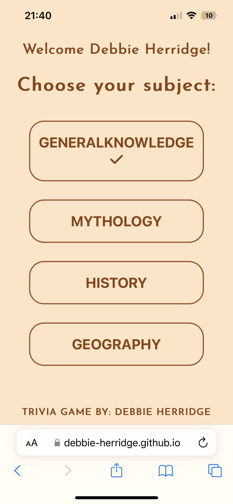

# Subject based triva quiz

This simple quiz is created to test the users knowledge on specific subjects. 

There is a a choice of four subjects:
- General Knowledge
- Mythology
- History 
- Geography

It has been coded using HTML, CSS and Java, therefore it is interactive and responsive to the users inputs and choices. The quiz maintains a nude tone and simple theme, with subtle hints of colour to indictate whether the user gets a question right or wrong.

To view the deployed website click [here](https://debbie-herridge.github.io/trivia-quiz/)

# UXD

## Website intentions

### To the user:

- A simple, sleek quiz to test specific subject knowledge
- To keep track of current score throughout the quiz
- Instant feedback from site to display correct answer

### To the developer:

- To use JavaScript to respond to user interaction
- To store data from the user and be able to retrieve and display when necessary
- To create general functions in which the users subject choice passes through and filters out the relavant questions

# Inital designs

## Balsamiq Wireframe:

## Colour scheme

Using [W3School](https://www.w3schools.com/cssref/css_colors.asp) I choose a brown and beige colour scheme, by using the same palette on each page of the quiz it keeps consistancy, and the monotone nature of using the same colour scheme brings a warm tone to the overall visuals of the quiz. 

Instead of the standard red and green for displaying correct/incorrect answers I have used tones more inline with my chosen colour scheme.

## Font

Using [GoogleFonts](https://fonts.google.com/specimen/Quicksand?sort=popularity&preview.text=WHAT%20IS%20YOUR%20NAME%3F&preview.text_type=custom) I chose Quicksand as it looks smooth and joyful, which fit perfectly with the colour scheme and help aid bring that warmth into the page.

As mentioned later in the design changes section, the font was later changed using media queries for smaller screens to Josefin Sans.

## Future features

With the addition of using an API to generate the questions, rather than hard coding it into a Java array, the user would be able to replay the quiz multiple times without repeat questions. This would be more beneficial as it would keep users on the site for longer.

Also in future the subject selection page will display all previous scores using the tick/cross icon, not just for the previously played subject. If the user was to pass all four subjects there would be a full screen animation to say congratulations.

# Site 

## Intro 

When site inital page is loaded, users will immediately be prompted to add their name (or nickname!) into the form. From the get-go the quiz has a inviting friendly feel about it, to help users feel intrigued and at ease.

The input field is marked as a requirement therefore users will not be able to progress without inputing text. If they try to they will be prompted to fill in the text box.

## Subject choice section

Users will then be taken to the page where they can choose the subject that they would like to be quizzed on. Each choice button has an onClick function that will store the users selection and use this information to filter out the array of questions for that specific subject.

## Quiz 

It is a simple, straightforward quiz with 4 multiple choice answers and a score tracker at the top. The score tracker uses Java to increment the score by one bonus point every time the user gets the question correct.

Java will loop through the choices and decide whether the user has clicked on the correct answer or not. There are instant colour visuals to let the player know how they have answered. If they get it correct their choice selection will change to green and after a short time they will automatically be move onto the next question.

If the player has got the answer incorrect, their choice will change to a dull beige and the correct answer will display in green. The sleep timer to move onto the next question is slightly longer if an incorrect answer was chosen so that the user has a chance to read the correct answer.

## End of quiz

At the end of each subject quiz the player will be taken to the end page where they can see their score out of the total amount of questions and click a button to be redirected back to the subject selection page where they can choose a different catagory.

## Back to subject selection

After finishing the previous subject the users score will be logged into local storage and can be seen on the homepage of the quiz. If they scored 3 or above correct answers the subject will be displayed with a tick on the end. If they failed it will be shown with a cross.

# Design changes

In the initial Balsamiq wireframes the whole quiz was meant to be inside the darker beige centered container, exactly how the name form page is currently. However when veiwing on mobile devices the overall design lost its sleek apeal and became far too cramped. Therefore I chose to just keep the landing page and end results page with this style as the div's did not contain to much inside.

Using media queries the font will change when the displayed on a small screen such as a phone, as the font chosen originally looks smooth on the computer but sharp on smaller devices.

# Testing

## Bugs

### Large screens

The quiz was created and coded on Google Chrome on a Mac. 

It has been played on Chrome, Safari and Firefox, all are displaying as intended. The site designed looks much cleaner and sleeker on the larger screens.

### Smaller screens / Mobile devices

When tested on GoogleDevTools mobile viewer - if the user has passed the General Knowledge section, when they return to the homepage where the tick or cross is displayed the name will become generalKnowledge, as per the Java code, with the text transform it doesn't appear too obvious on larger screens. But when played on a mobile it doesn't text allign in its container as it has been pulled accross from Java. 

However when tested on an actual mobile device the icon didn't go outside of the button it went below the text as desired. It did still have the issue of the title being shown without the space between 'General' and 'Knowledge', but I expected this to be the case. There was however an issue with the text input on the form page being a slightly yellowed tone.

Device - iPhone 13:

The game has also been played on iPhone 11 pro max, iPhone 12, and iPhone 12 pro max using Safari. All screens show the same display. 

It has only been tested on one Andriod phone and that was a Google Pixel 5, no issues reported and the feedback was: "Simple, easy, good". 

There was feedback to add a final animation after completing all four subjects which will come from later development.

## Errors

A bug that was alarming was my deployed project kept coming up with either error 405, error 404 or error 501. I made several changes and pushing them to GitHub to view whether it has solved the issue on the deployed site as Port 8000 from GitHub was not showing any errors. After researching what these errors actually mean I came to realise the error was with my first page form, the form was adding 'name=' and the users input into my URL. I fixed this by adding 'method' to my form and removing the 'name=' from my input. I also had to change all file paths in JavaScript to be relative as they were previously coded as absolute. All of these combined fixed all issues and the deloyed site now works with no errors and links to all pages are working correctly.

# Code validators

## HTML

Initally none of my HTML code passed the validator. This was due to my heading being inside my button tag. Once I swapped this around and added template text into areas where JavaScript populated it passed the both website validators. 

By swapping the heading to be outside of the button I had to amend my JavaScript code as it was previously written to add a class to the parent element to show the colour response for the users choice. This was a quick fix and meant my code worked as per before.

[https://validator.w3.org/](assets/images/html-validator-pass.png)
[https://appdevtools.com/html-validator](assets/images/second-html-validator-pass.png)

### Index HTML

### Second page HTML

### Third page HTML

### End page HTML

## CSS Validator

The CSS code passed the validator with no issues.

## JavaScript Validator

I ran the JavaScript through 3 different validators:

### 1

[CodeBeautify](https://codebeautify.org/jsvalidate)

This validator came back with 11 issues. I amended the minor issue with the missing semi colon and missing space between a parenthesis and curly bracket which brought it down to 9 issues. 

It was the only validator to raise an issue about a missing 'be strict' statement, which I don't believe in necessary in the code.

There was multiple issues with line 11 using backticks, but this was used later on in the script in the same way and not raised as an issue. It also did not appear as an issue with any of the other validators used.

All of the issues raised by this validator have not been brought up in the following two validators, and after trying to amend code to remove this issues with no avail, I decided to leave these be. 

### 2

[Esprima](https://esprima.org/demo/validate.html)

The JavaScript code passed this validator with no issues.

### 3

[ExtendsClass](https://extendsclass.com/javascript-fiddle.html)

This validator brought up no distinct issue, rather advise on [''] being better written in dot notation. Whilst I agree with this I saw no immediate threat to my current code and have left it untouched.

The other advise this validator raised was that the code used on this project is only available in ES6. Again, I see no reason to amend my code as the systems used to display this project are fully supportive of the latest JavaScript revision.

# Credits

## Tutorials for inserting API:

In an attempt to insert an API into this quiz I watched the following YouTube tutorials. After careful deliberation I decided to hard code my questions an focus on creating a more bulletproof JavaScript project. However these tutorials have been very insightfull and deserve credit. As mentioned in the future I will look to add the API side to this quiz project.

[GeekProbin](https://www.youtube.com/watch?v=-cX5jnQgqSM)

[Benjamin Siegel](https://www.youtube.com/watch?v=SgJ_femmsfg)

[Code with Ania Kubów](https://www.youtube.com/watch?v=zgHim4ZDpZY)

## For code:

A massive thank you to [James Q Quick](https://www.youtube.com/watch?v=u98ROZjBWy8&list=PLDlWc9AfQBfZIkdVaOQXi1tizJeNJipEx) who has done a full indepth tutorial on how to create a quiz using HTML, CSS and JavaScript. Code has been adapted from his tutorial to suit my site, but the slow pace descriptive videos have been extremely helpful.

## For code queries:

I used Stack Overflow to help with any queries related to JavaScript. My main query that I was to dive into and learn about was local storage, and Stack helped me understand the concept.

[Stack - local storage](https://stackoverflow.com/questions/35329180/localstorage-save-name-through-form-show-on-other-page)

[Stack - getting the id for the users subject choice](https://stackoverflow.com/questions/4825295/onclick-to-get-the-id-of-the-clicked-button)

[Programming head - to use JavaScript to change the page](https://programminghead.com/how-to-link-submit-button-to-another-page-in-html.php)